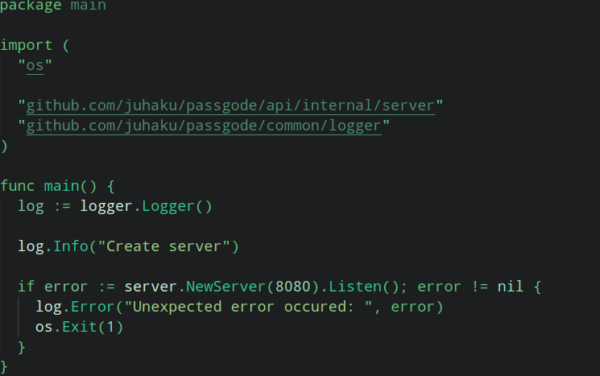
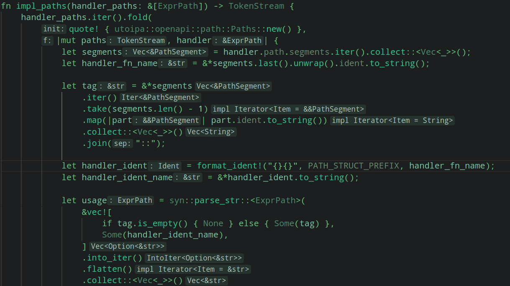
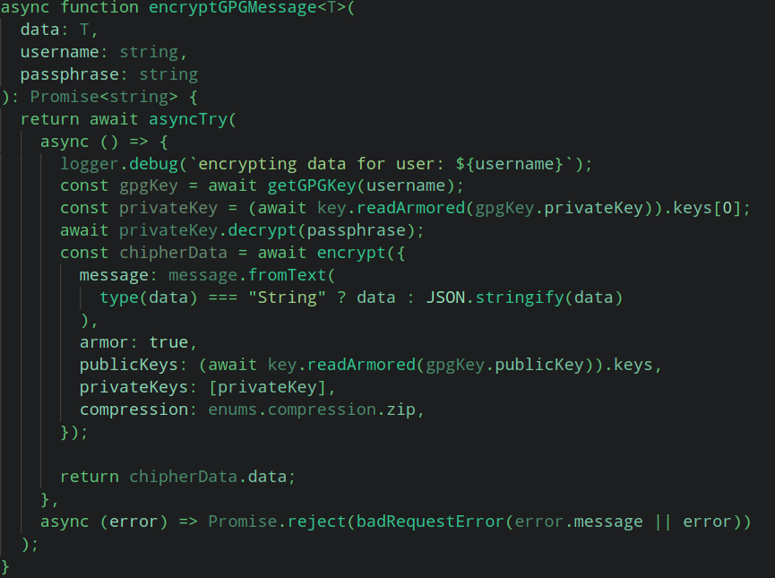
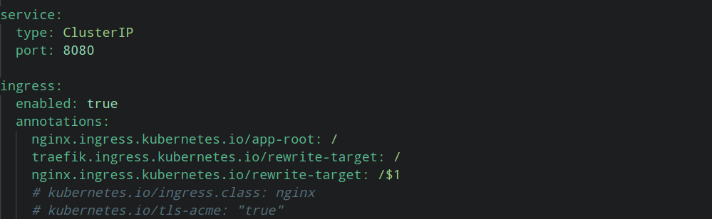
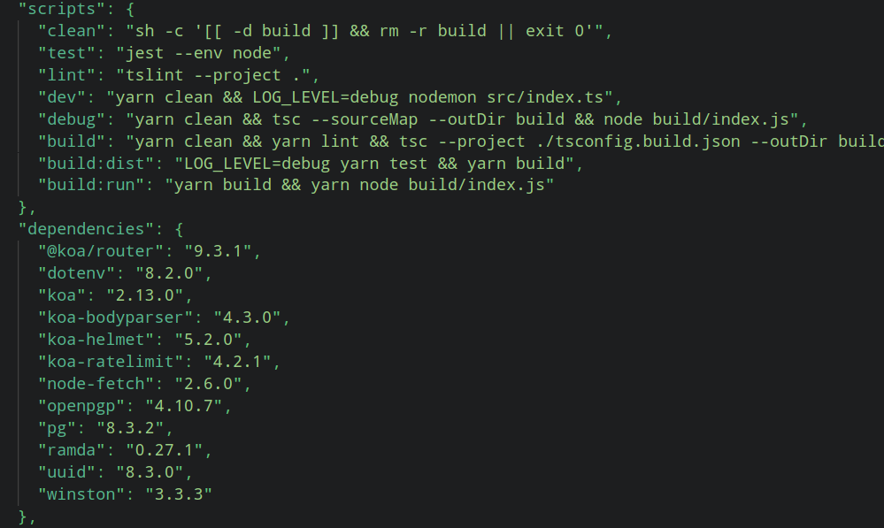
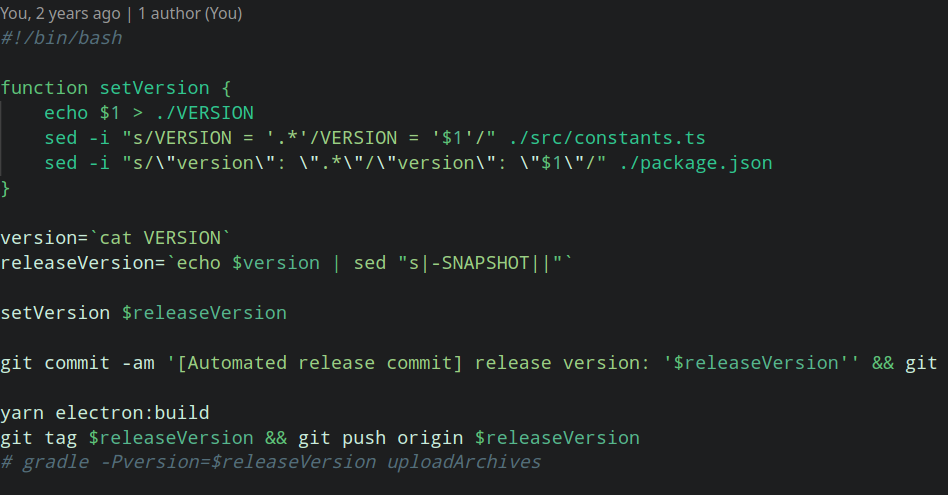
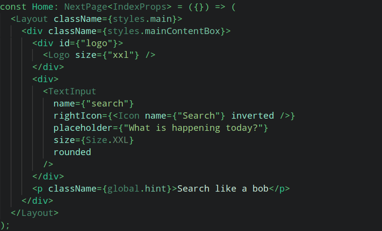
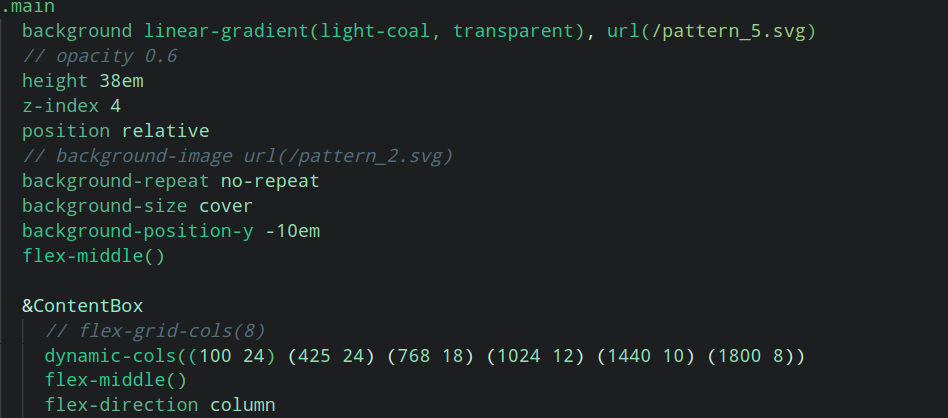
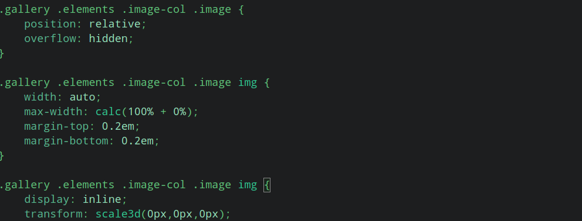
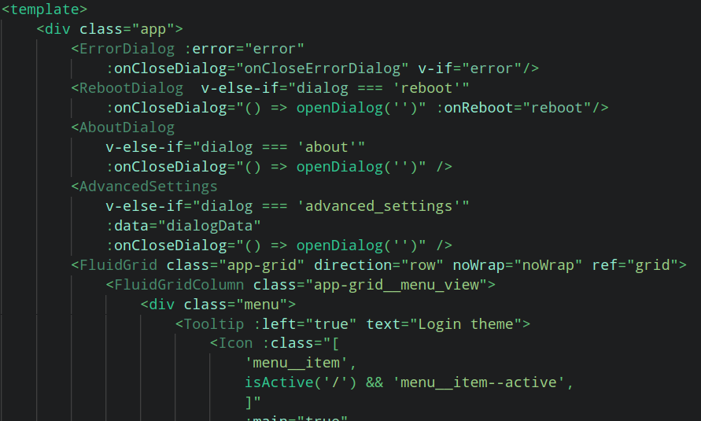

# matcha-colors  ~ (Matcha Colors VSCode Theme)

This is Matcha colored VSCode Color Theme.

## Download

https://github.com/juhaku/matcha-colors/releases/download/1.2.3/matcha-1.2.3.vsix

Or build from sources with:

```bash
git clone https://github.com/juhaku/matcha-colors.git
cd matcha-colors
yarn install
yarn vsce package
```

## Install

1. Open Code
2. Open Extensions
3. Click "View More Actions" the three dots (...) -> Install from VSIX
4. DONE!

## Screenshots

#### GO


#### Rust


#### TypeScript


#### Yaml


#### JSON


#### Bash


#### JSX/TSX


#### Stylus


#### CSS


#### Vue

